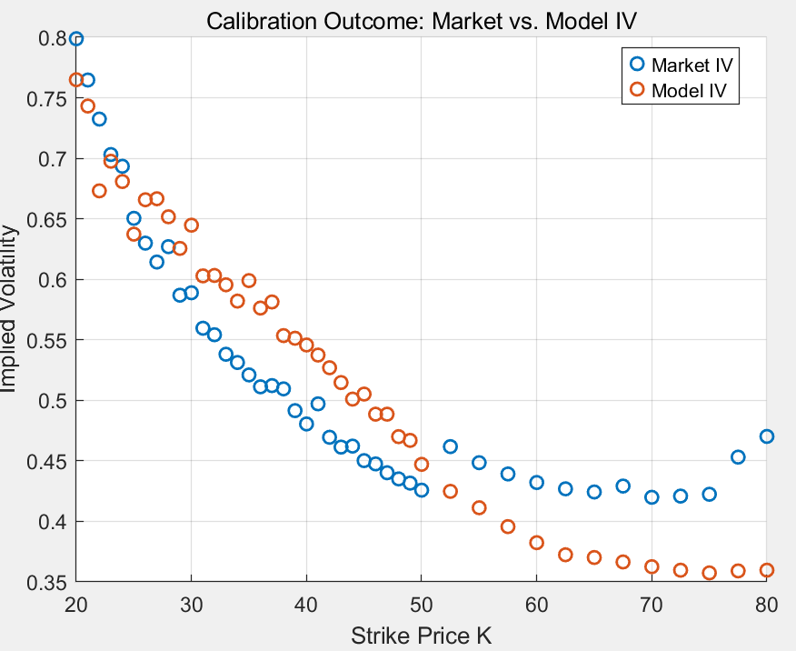
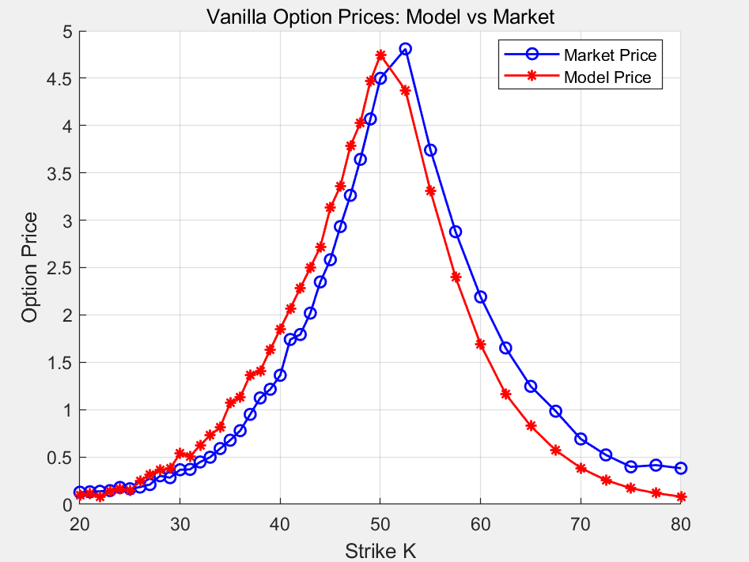

# Bonus Certificate pricing and hedging under the Bates model

Design, valuation and delta hedge of a Bonus Certificate on Delta Air Lines (DAL) stock, written in MATLAB. Vanilla options are priced with a Carr-Madan FFT under the Bates model (Heston stochastic volatility plus Merton jumps), the model is calibrated to the DAL implied-volatility smile, and the path-dependent part of the certificate is priced by Monte Carlo.

Pricing date is 16 May 2025 and the certificate matures on 19 September 2025, the expiry of the listed options used for calibration.

Coursework project for Financial Engineering, Master of Actuarial and Financial Engineering, KU Leuven (2025). The full write-up is in [`report/Bonus_Certificate_Report.pdf`](report/Bonus_Certificate_Report.pdf).

<p align="center">
  
  
</p>

## The product

At maturity the investor receives

- `max(S_T, B)` if the stock never traded below the barrier `H`
- `S_T` if the barrier was touched

The issuer replicates this with a long position in the stock and a long down-and-out put with strike `B` and barrier `H`, and invests the margin in a risk-free account.

| Parameter | Value | Notes |
|---|---|---|
| Spot `S0` | 50.46 | DAL spot on 16 May 2025 |
| Bonus level `B` | 60.55 | 120% of spot |
| Barrier `H` | 40.37 | 80% of spot |
| Maturity `T` | 0.345 years | 126 days |
| Dividend yield `q` | 1.32% | forward dividend yield |
| Risk-free rate `r` | 4.355% | 4-month US Treasury zero rate |

## Method

**FFT pricer.** `charfun_bates.m` implements the Bates characteristic function with the jump drift compensation. `bates_price_fft.m` applies the Carr-Madan damped transform (alpha = 1.5, 2^12 grid points, Simpson weights) and reads call prices off the log-strike grid. Puts come from put-call parity.

**Calibration.** `main_calibration.m` fits the model to market implied volatilities with `lsqnonlin` in two steps. The Heston parameters are fitted first with the jumps switched off, then all eight parameters are released and refitted from that starting point. At each iteration the FFT prices are inverted to implied volatilities, so the residuals are in volatility units.

**Monte Carlo.** The certificate is simulated with an Euler scheme on the Bates dynamics (200,000 paths, 200 time steps), checking the barrier at every step. The delta is a central difference with a bump of 1% of spot, using common random numbers for the up and down paths. The standalone down-and-out put in `do_put_mc.m` uses a constant-volatility approximation with `sigma = sqrt(v0)`.

## Results

| Quantity | Value |
|---|---|
| Vanilla put at strike `B` (FFT) | 10.93 |
| Down-and-out put (Monte Carlo) | 3.11 |
| Hedging cost `S0 + P_KO` | 53.57 |
| Issue price at a 2% margin | 54.64 |
| Certificate delta | 0.8783 |
| Hedge for a $1,000,000 issue | long 878,273 shares |

The calibrated model reproduces the downward skew of the DAL smile. It sits above the market volatilities for strikes below about 50 and below them for higher strikes, so there is room to refine the jump intensity or the vol of vol.

## Repository layout

```
main_calibration.m       two-step Bates calibration, writes data/calibrated_params.mat
main_pricing.m           prices the certificate, computes the delta, saves the figures
src/
  charfun_bates.m        Bates characteristic function
  bates_price_fft.m      Carr-Madan FFT pricer for European calls
  calibration_err_iv.m   implied-volatility residuals for lsqnonlin
  bc_price_mc.m          Monte Carlo price of the certificate
  bc_price_mc_delta.m    Monte Carlo price and delta (central difference)
  do_put_mc.m            Monte Carlo down-and-out put and survival probability
data/
  calibrated_params.mat  calibrated Bates parameters
figures/                 output plots
report/                  full project report (PDF)
```

## Running the code

Requires MATLAB with the Optimization Toolbox and the Financial Toolbox. The Parallel Computing Toolbox is optional; `lsqnonlin` uses it when available.

```matlab
main_calibration   % optional: recalibrates and overwrites data/calibrated_params.mat
main_pricing       % prints the valuation and saves the plots to figures/
```

Option quotes (Yahoo Finance) and the US Treasury rate (worldgovernmentbonds.com) are entered directly in the two main scripts.
